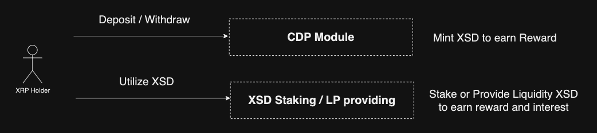

### Interaction Flow

1. **User Deposit**: XRP is deposited as collateral.
2. **Stablecoin Minting**: Users can mint XSD stablecoins based on the collateral.
3. **Yield Generation**: Minted XSD can be used for earning yield, either through staking or liquidity provision.



---

## Functions

The dApp includes three primary functions:

- **Deposit**: Users deposit XRP as collateral.
- **Mint**: Collateralized stablecoins are minted based on deposited assets.
- **Earn**: Users can earn yield on their stablecoins through staking and liquidity provision.

---

## Quick Start Guide

To start using xrBankDAO, follow these steps:  
node : >= 18

1. **Clone the Repository**:
   ```bash
   git clone git@github.com:xrBankDao/frontend.git
   cd frontend
   ```
2. **install and start**:
   ```bash
   npm install
   npm start
   ```
