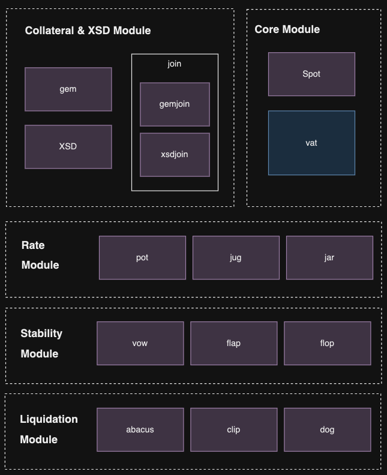
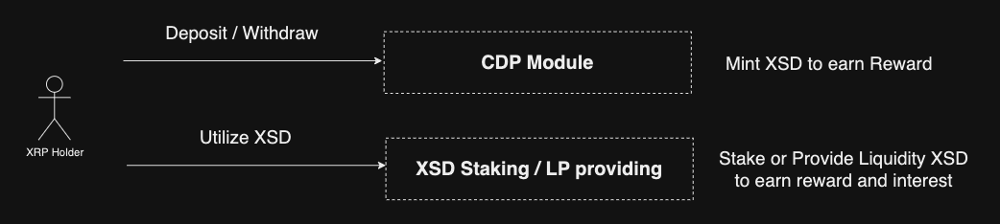

# xrBankDAO: The Liquidity Layer for XRP EVM-Sidechain

XrBankDAO was created to provide stablecoin liquidity to the emerging XRPL EVM sidechain, fostering growth within the ecosystem. Additionally, it was developed to enable XRP holders who supply liquidity to utilize their assets more efficiently and, if needed, to use stablecoins with low volatility.

## Why xrBankDAO?

XRPL’s DeFi ecosystem holds tremendous potential. In the Korean market alone, over 8 billion XRP are held on centralized exchanges (CEX, upbit/bithumb), with more than 2 million holders. However, the DeFi market remains relatively undeveloped.

Moving forward, XRPL plans to launch its own fiat-backed stablecoin and an EVM sidechain. However, relying solely on bridged fiat-backed stablecoins introduces risks such as volatility of backing assets, bridge vulnerabilities, and supply shortages.

We are committed to filling this crucial gap by introducing a robust, crypto-backed stablecoin that will serve as the foundation for XRPL’s DeFi ecosystem. This stablecoin will not only enhance the security and stability of the network but also provide XRP holders with new opportunities to earn yield and participate in decentralized finance. Our vision is to unlock the full potential of XRPL’s DeFi capabilities, ensuring that it becomes a leading player in the global blockchain economy.

---

## System Design Diagrams and Narrative

### System Design Overview

xrBankDAO’s architecture follows a decentralized model to maintain security and reliability. The core contracts handle collateral, stablecoin issuance, yield generation, and liquidation if necessary. The primary components include:

- **Vault**: Manages collateral deposits, mints stablecoins, and ensures solvency.
- **Minting**: Allows users to mint stablecoins (XSD) against their deposited XRP collateral.
- **Earnings**: Users can earn yield by providing liquidity or through interest-bearing features on XSD.



### Interaction Flow

1. **User Deposit**: XRP is deposited as collateral.
2. **Stablecoin Minting**: Users can mint XSD stablecoins based on the collateral.
3. **Yield Generation**: Minted XSD can be used for earning yield, either through staking or liquidity provision.



---

## Functions

The dApp includes three primary functions:

- **Deposit**: Users deposit XRP as collateral.
- **Mint**: Collateralized stablecoins are minted based on deposited assets.
- **Earn**: Users can earn yield on their stablecoins through staking and liquidity provision.

---

## Quick Start Guide

To start using xrBankDAO, follow these steps:

1. **Clone the Repository**:
   ```bash
   git clone https://github.com/your-repo/xrBankDAO.git
   cd xrBankDAO
   ```
